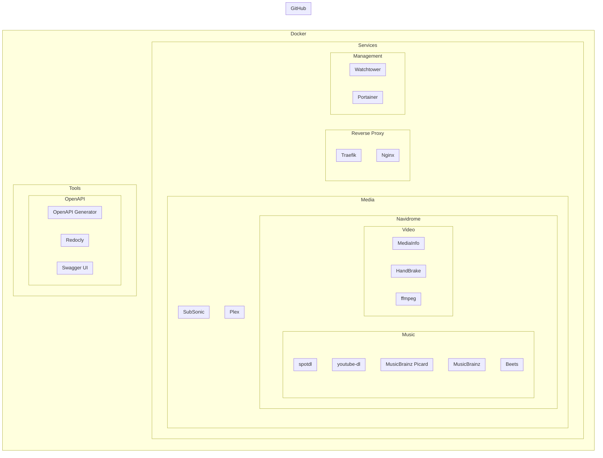

---

---

# Architecture

## Overview

This project uses the following architecture:


```mermaid
graph LR
    subgraph "Docker"
        subgraph "Services"
            subgraph "Media"
                subgraph "Navidrome"
                    subgraph "Music"
                        subgraph "Beets"
                        end
                        subgraph "MusicBrainz"
                        end
                        subgraph "MusicBrainz Picard"
                        end
                        subgraph "youtube-dl"
                        end
                        subgraph "spotdl"
                        end
                    end
                    subgraph "Video"
                        subgraph "ffmpeg"
                        end
                        subgraph "HandBrake"
                        end
                        subgraph "MediaInfo"
                        end
                        subgraph "youtube-dl"
                        end
                    end
                end
                subgraph "Plex"
                end
                subgraph "SubSonic"
                end
            end
            subgraph "Reverse Proxy"
                subgraph "Nginx"
                end
                subgraph "Traefik"
                end
            end
            subgraph "Management"
                subgraph "Portainer"
                end
                subgraph "Watchtower"
                end
            end
        end
        subgraph "Tools"
            subgraph "OpenAPI"
                subgraph "Swagger UI"
                end
                subgraph "Redocly"
                end
                subgraph "OpenAPI Generator"
                end
            end
        end
    end
    subgraph "GitHub"
    end
```
```
